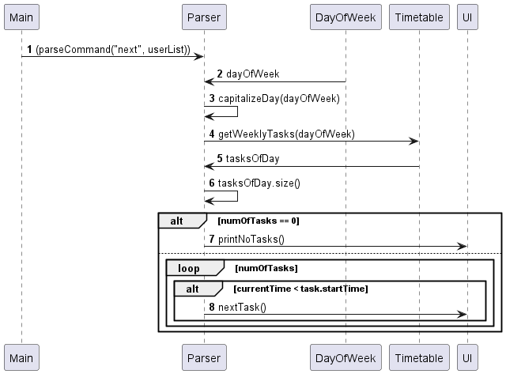

# Developer Guide

## Design & implementation

### Save timetable function
The saving timetable mechanism is facilitated by the Storage class. It implements the following operations: 
* `Storgae#createFolder()`: Creates a folder in the directory where all the users' timetable will be stored in the local computer.
* `Storage#addExistingUsers()`: Loops through the folder to add all previous saved users upon opening the app, as well as their corresponding tasks.
* `Storage#addUserInFolder(User user)`: When a new user is added, a file with the name of the user will be created in the folder.
* `Storage#writeTaskInFile(User user)`: when a new task of a specific user is added, it will be written into the correct file.

The following sequence diagram shows how the operations in the Storage class goes through when the app is opened and it loads data from history:

## Parser Component

Here is a general guide of how Parse Class looks like in sequence diagram.

Here is a class diagram for the method changeTaskTiming method in Parser Class.

The following sequence diagram of changeTaskTiming shows the interactions with other objects.

Here is how this method works:

1. The Parser calls the changeTaskTiming method with a command and the UserList. It calls InputValidator.

2. The InputValidator validates the command, ensuring that it meets the required format in days and index.

3. If validation is successful, the User calls the timetable and calls its changeFlexibleTaskTiming method with the specified parameters.

4. The Timetable updates the timing of the flexible task.

5. If successful, the InputValidator sends a success message back to the Parser. Otherwise, it throws a RuntimeException.

## Timetable Component
Here is a sequence diagram of changeTaskType method in Timetable class. It shows the interactions with other objects.

Here is how this method works:
1. The sequence starts with the Parser sending a request to the Timetable to change the type of a task.

2. The Timetable activates and processes the changeTaskType method.

3. Within the Timetable, the dayOfWeek parameter is capitalized to ensure consistency.

4. The Timetable calls the list of tasks associated with the specified day (dayOfWeek). It activates the Task object to fetch the task at the specified index (index).

5. The Task object modifies the type of the task to the new type specified by the Parser.

6. Finally, the modified task or any relevant status information is returned to the Parser.

## Next Command

Proposed implementation

The next command displays the next task of the current user based on the current time. Given below is how it works. 

Step 1: The user launches the application, creates a user, and creates several tasks for the user. 

Step 2: The user types the command 'next' to see their next task. 

Step 3: The next command is triggered. It first determines the current day and takes the arraylist of tasks of the user's timetable on that day. 

Step 4: It then loops through the tasks on that day, starting from the back (the later tasks), until the task's start time is before the current time. 

Step 5: It displays the last task it looped though, or a special message if there is no task that day. 

# Appendix: Project Requirements
## Product scope
### Target user profile

People who
* have busy timetables
* wish to be able to compare theirs with their friends' easily
* prefer desktop apps over other types
* can type fast
* prefer typing to mouse interactions
* are reasonably comfortable using CLI apps

### Value proposition

The app can store multiple timetables and easily display and compare them automatically, saving the time and effort of doing so by hand. 

## User Stories

| Version | As a ... | I want to ...             | So that I can ...                                                |
|---------|----------|---------------------------|------------------------------------------------------------------|
| v1.0    | new user | see usage instructions    | refer to them when I forget how to use the application           |
|         | user     | add a new user            | store my timetable                                               |
|         | user     | switch users              | interact with my own timetable                                   |
|         | user     | add a task                |                                                                  |
|         | user     | compare two timetables    | see the common time between them                                 |
| v2.0    | user     | find a to-do item by name | locate a to-do without having to go through the entire list      |
|         | user     | specify task importance   | remember if a task is important or not                           |
|         | user     | compare all timetables    | view a summurized timetable comprising of all current timetables |

## Non-Functional Requirements

1. Should work on any mainstream OS (Windows, Linux, Unix, MacOS) as long as it has Java 11 or above installed.
2. Should be able to hold up to 10 persons without a noticeable sluggishness in performance for typical usage.
3. A user with above average typing speed for regular English text (i.e. not code, not system admin commands) should be able to accomplish most of the tasks faster using commands than using the mouse.

## Glossary

* **User** - A person using this app.
* **Timetable** - A number of tasks belonging to a specific user.
* **Task** - An event in a timetable, with a description, start time, end time, and type.

## Instructions for manual testing

Given below are instructions to test the app manually.

### Launch and Shutdown

1. Initial launch

Download the jar file and copy into an empty folder. Double-click the jar file. Expected: Shows the GUI with a list of commands. The window size may not be optimum; adjust it as necessary.

2. Shutdown

Enter 'bye'. The app should close and all current data should be saved in a data folder. 

### Add user

Prerequisites: None

* Valid command: `adduser User1`. Expected: Confirmation that user was added. 
* Invalid command: `adduser`. Expected: Error message shown. 
* Invalid command: `adduser User1`, where User1 already exists. Expected: Error message shown. 

### Add task

Prerequisites: At least one user has been added 

* Valid command: `addtask /on Monday /task test1 /from 9:00 /to 11:00 /type f`. Expected: Confirmation that task was added. 
* Invalid commands. Expected: Error message shown detailing expected format. 
  * `addtask /on Monday`
  * `addtask /on Monday /task description`
  * `addtask /on Monday /task description /from 09:00 /to 11:00`
  * `addtask Monday description 09:00 11:00`
  * `addtask /on MONDAY /task description /from 09:00 /to 11:00`
